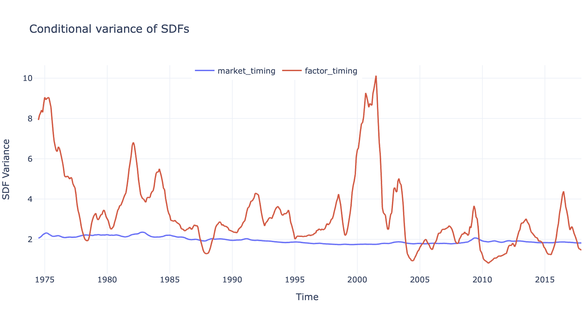
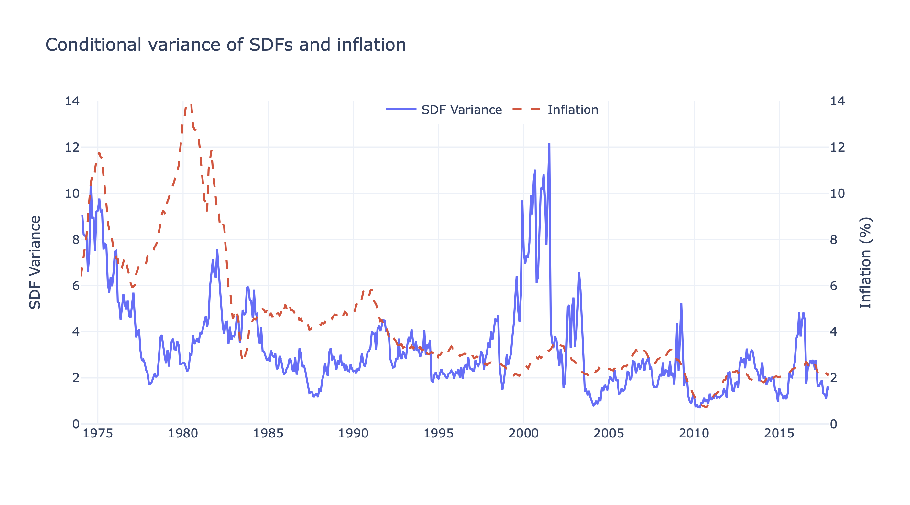
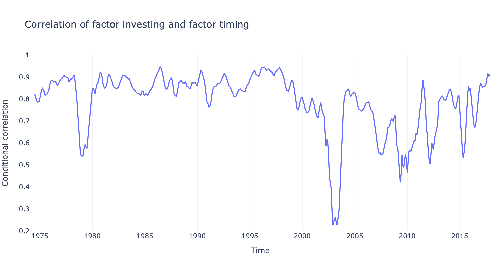
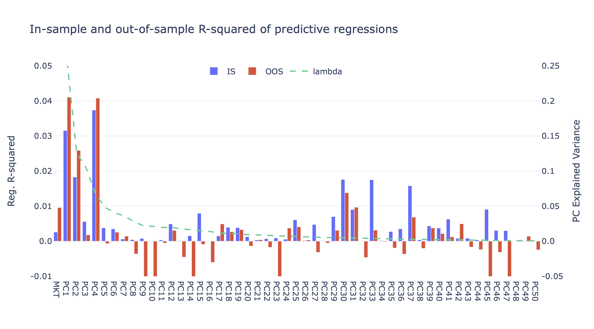
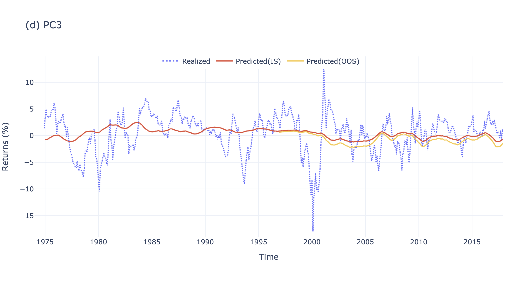
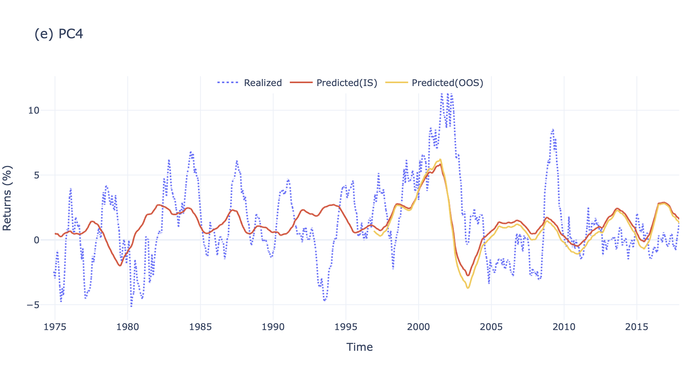
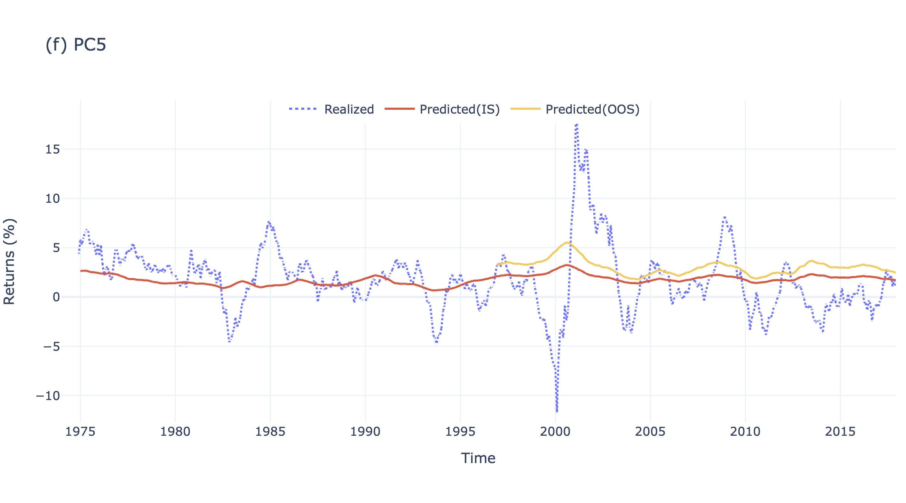

# Replication: Factor Timing

This repository replicates the findings from the paper titled *Factor timing* by **Valentin Haddad, Serhiy Kozak, and Shrihari Santosh**, published in The Review of Financial Studies in 2020. The paper delves into the significance of factor timing, its optimal portfolio equivalence to the stochastic discount factor, and its predictability in market-neutral equity factors.

[Link to the original paper on SSRN](https://papers.ssrn.com/sol3/papers.cfm?abstract_id=2945667).

## Abstract:
> The optimal factor timing portfolio is equivalent to the stochastic discount factor. We propose and implement a method to characterize both empirically. Our approach imposes restrictions on the dynamics of expected returns which lead to an economically plausible SDF. Market-neutral equity factors are strongly and robustly predictable. Exploiting this predictability leads to substantial improvement in portfolio performance relative to static factor investing. The variance of the corresponding SDF is larger, more variable over time, and exhibits different cyclical behavior than estimates ignoring this fact. These results pose new challenges for theories that aim to match the cross-section of stock returns.

## Dataset:
The dataset used in this replication is sourced from Serhiy Kozak's [webpage](https://www.serhiykozak.com/data).

## Repository Structure:
- **Main.py**: Contains code to generate the plots featured in the results section.
- **FT-17APR19-monthly**: The dataset referenced in the paper.

## Results:

### Conditional Variance of the SDF

> This figure plots the conditional variance of the SDF, constructed in two ways. The blue line uses the “factor timing” construction, which allows for variation in the means of the PCs and the market. The red line is a “market timing” estimate that ignores predictability of the anomaly factors. 

### Conditional Variance of the SDF and Inflation

> This figure plots the conditional variance of the SDF (solid blue line), and inflation rate over the previous year (dashed rate line). The SDF variance is constructed using the predictive regressions reported in Table 2. The inflation rate is the annual log change in the CPI.

### Correlation of Factor Investing and Factor Timing

> Conditional correlation of the estimated SDF and the misspecified SDF un- der the assumption of no factor timing benefits. This figure plots the conditional correlation our estimated SDF and a misspecified version which sets conditional factor means to their sample averages. Reported values are six-month averages.

## Return Predictions:

### Predictability of Principal Components

> The plot shows the in-sample (IS) and out-of-sample monthly R2 of predicting each PC of anomaly portfolio returns with its own bm ratio. The dotted gray line (using the right axis) shows the fraction of total variance explained by each PC.

### PC1-PC5 Prediction

> Realized and Predicted Return. The plot shows realized returns along with full sample and out-of-sample forecasts of returns on the aggregate market and first five PC portfolios of the fifty anomalies.

