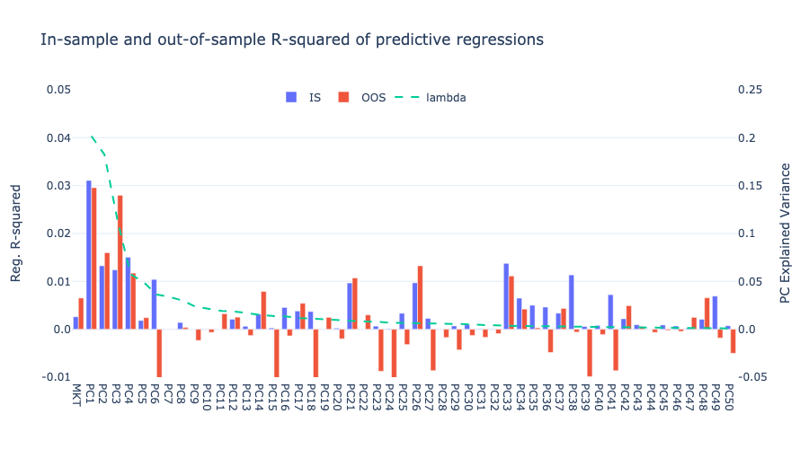
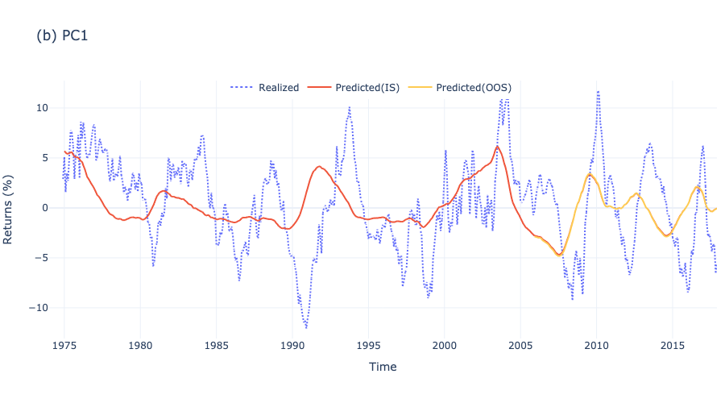
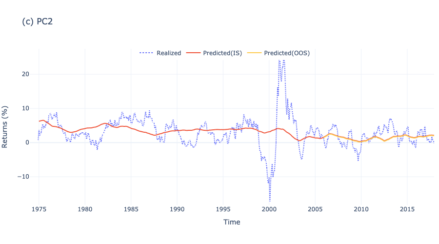
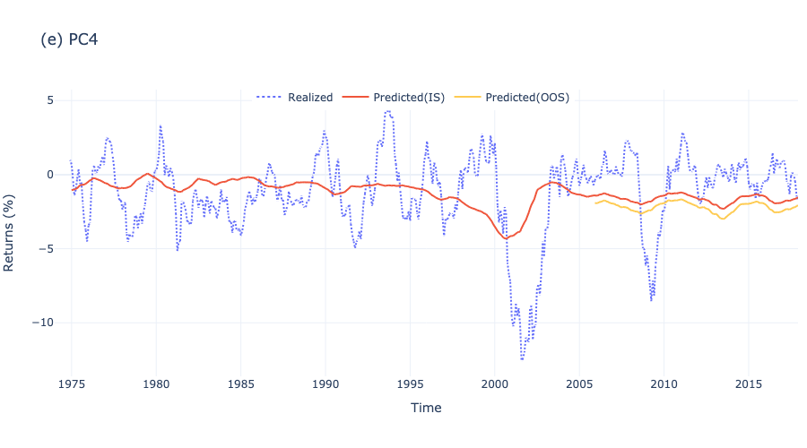
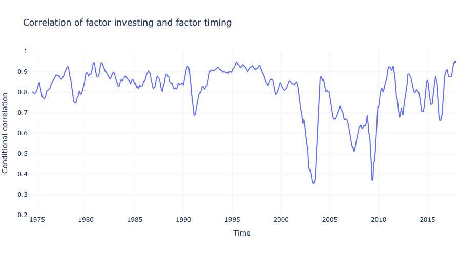

# Replication: Factor Timing

This repository replicates the findings from the paper  *Factor timing* by **Valentin Haddad, Serhiy Kozak, and Shrihari Santosh**, published in The Review of Financial Studies in 2020. The paper delves into the predictability of market-neutral equity factors and examines the impact of factor timing on estimating the stochastic discount factor and the optimal factor timing portfolio."

[Link to the original paper on SSRN](https://papers.ssrn.com/sol3/papers.cfm?abstract_id=2945667).

## Abstract:
> The optimal factor timing portfolio is equivalent to the stochastic discount factor. We propose and implement a method to characterize both empirically. Our approach imposes restrictions on the dynamics of expected returns which lead to an economically plausible SDF. Market-neutral equity factors are strongly and robustly predictable. Exploiting this predictability leads to substantial improvement in portfolio performance relative to static factor investing. The variance of the corresponding SDF is larger, more variable over time, and exhibits different cyclical behavior than estimates ignoring this fact. These results pose new challenges for theories that aim to match the cross-section of stock returns.

## Dataset:
The dataset used in this replication is sourced from Serhiy Kozak's [webpage](https://www.serhiykozak.com/data).

## Repository Structure:
- **Main.py**: Contains code to generate the plots featured in the results section.
- **FT-17APR19-monthly**: The dataset referenced in the paper.

# Results

## Return Predictions

### Predictability of Principal Components

> We report results from predictive regressions of excess market returns and five PCs of long-short anomaly returns. The market is forecasted using the log of the ag- gregate book-to-market ratio. The anomaly PCs are forecasted using a restricted linear combination of anomalies log book-to-market ratios with weights given by the corresponding eigenvector of pooled long-short strategy returns. The first row shows the coeffcient estimate. The second row shows asymptotic t-statistics. The third and fourth rows show the out-of-sample results. The fifth and sixth rows shows the in-sample and out-of-sample monthly R^2.

> The plot shows the in-sample (IS) and out-of-sample monthly R2 of predicting each PC of anomaly portfolio returns with its own bm ratio. The dotted gray line (using the right axis) shows the fraction of total variance explained by each PC.

### PC1-PC5 Prediction Over Time

> Realized and Predicted Return. The plot shows realized returns along with full sample and out-of-sample forecasts of returns on the aggregate market and first five PC portfolios of the fifty anomalies.

## Properties of the SDF

### Performance of Portfolio Strategies

> The table presents the unconditional Sharpe ratio, information ratio, and average mean-variance utility for five di↵erent strategies. The strategies include: (i) static factor investing based on unconditional estimates; (ii) market timing using forecasts of the market return but with unconditional values for PC returns; (iii) full factor timing incorporating predictability of both PCs and the market; (iv) anomaly timing using forecasts of the PCs while setting market returns to unconditional values; and (v) pure anomaly timing investing in anomalies based on the deviation of their forecast from the unconditional average. The strategies assume a homoskedastic conditional covariance matrix estimated from forecast residuals. Information ratios are calculated relative to the static strategy, and out-of-sample (OOS) values are obtained through a split-sample analysis with parameter estimation using the first half of the data.

### Conditional Variance of the SDF

> This figure plots the conditional variance of the SDF, constructed in two ways. The blue line uses the “factor timing” construction, which allows for variation in the means of the PCs and the market. The red line is a “market timing” estimate that ignores predictability of the anomaly factors. 

> We report the average conditional variance of the SDF and its standard deviation constructed under various sets of assumptions. “Factor timing” is our full estimate, which takes into account variation in the means of the PCs and the market. “Factor investing” imposes the assumption of no factor timing: conditional means are re- placed by their unconditional counterpart. “Market timing” only allows for variation in the expectation of the market return.

### Conditional Variance of the SDF and Inflation

> This figure plots the conditional variance of the SDF (solid blue line), and inflation rate over the previous year (dashed rate line). The SDF variance is constructed using the predictive regressions reported in Table 2. The inflation rate is the annual log change in the CPI.

### Correlation of Factor Investing and Factor Timing

> Conditional correlation of the estimated SDF and the misspecified SDF un- der the assumption of no factor timing benefits. This figure plots the conditional correlation our estimated SDF and a misspecified version which sets conditional factor means to their sample averages. Reported values are six-month averages.
